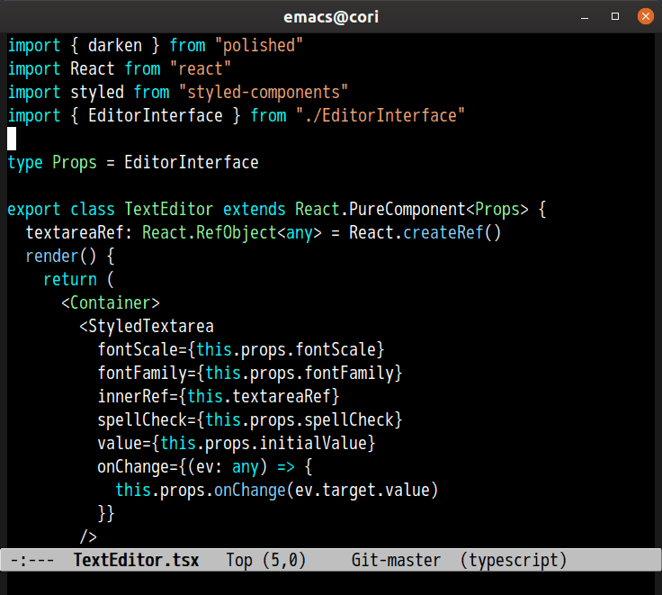

# import-cost.el

## Introduction

Port of [VScode import-cost extension](https://github.com/wix/import-cost)

## Screenshot

## Basic Usage

### `M-x import-cost`

Insert package size

### `M-x import-cost-setup`

Setup this package

### `M-x import-cost-clear`

Clear package size overlays
